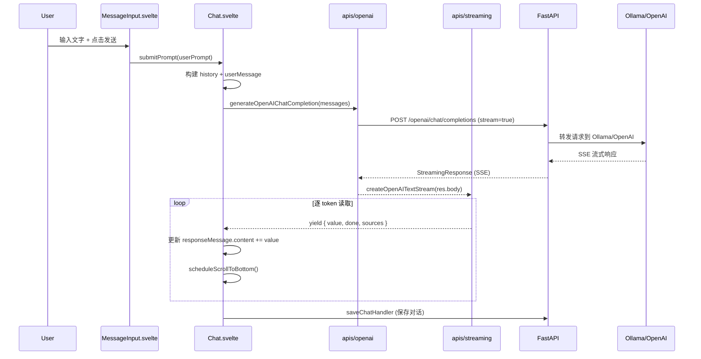

# Open WebUI 拆解 + 个人版 AI App 骨架计划

## 一、Open WebUI 架构全景

### 技术栈
- **前端**: SvelteKit 5 + Tailwind 4 + TypeScript，构建为 SPA（adapter-static），输出到 `build/`
- **后端**: Python FastAPI + SQLAlchemy + Socket.IO，入口 [backend/open_webui/main.py](d:\ai_top\open-webui\backend\open_webui\main.py)
- **通信**: REST API + Socket.IO（WebSocket）双通道
- **构建**: Vite 5，前端编译后由 FastAPI StaticFiles 托管

### 目录结构（精简版）

```
open-webui/
  src/                          # SvelteKit 前端
    routes/
      (app)/                    # 主应用路由组
        c/[id]/+page.svelte     # 聊天页（核心！只是一行：<Chat chatIdProp={id} />）
        home/                   # 首页
        workspace/knowledge/    # 知识库管理
      auth/                     # 登录页
    lib/
      apis/                     # 前端 API 层（按功能拆分）
        streaming/index.ts      # SSE 流式解析（核心！）
        ollama/index.ts         # Ollama API 封装
        openai/index.ts         # OpenAI API 封装
        audio/index.ts          # 语音 STT/TTS API
        retrieval/index.ts      # RAG 检索 API
        chats/index.ts          # 聊天 CRUD
        files/index.ts          # 文件上传
      components/
        chat/                   # 聊天组件集（核心！）
          Chat.svelte           # 聊天主体（~3000行，核心逻辑全在这）
          MessageInput.svelte   # 输入框组件
          Messages.svelte       # 消息列表
          MessageInput/         # 输入子组件（语音、文件、命令等）
          Messages/             # 消息渲染子组件（Markdown、代码块等）
        layout/                 # 布局组件（Sidebar等）
      stores/index.ts           # Svelte Store 全局状态
      constants.ts              # API Base URL 等常量
      utils/audio.ts            # AudioQueue 音频播放队列
  backend/
    open_webui/
      main.py                   # FastAPI 主入口
      routers/                  # API 路由（按功能拆分）
        ollama.py               # Ollama 代理转发
        openai.py               # OpenAI 代理转发
        audio.py                # STT/TTS
        retrieval.py            # RAG 检索
        chats.py                # 聊天 CRUD
        files.py                # 文件管理
      socket/main.py            # Socket.IO 实时通信
      models/                   # SQLAlchemy 数据模型
      retrieval/                # RAG 核心逻辑
```

### 数据流：一条消息从输入到显示



## 二、6 个核心模块拆解

### 模块 1：聊天页结构

**源码位置**: [src/lib/components/chat/Chat.svelte](d:\ai_top\open-webui\src\lib\components\chat\Chat.svelte)（~3000行）

**核心组成**:
- 顶栏 `Navbar` - 模型选择、聊天标题
- 消息区 `Messages` - 消息列表渲染
- 输入区 `MessageInput` - 文本输入 + 文件 + 语音 + 命令
- 控制面板 `ChatControls` - 系统提示、参数调整

**状态管理**: 通过 Svelte Store (`$lib/stores`) 管理全局状态，Chat.svelte 内部维护 `history`（消息树结构）、`selectedModels`、`generating` 等局部状态。

**精简抄法**: 只需要保留 Navbar + Messages + MessageInput 三层结构，去掉多模型并发、Artifacts、Overview 等高级功能。

### 模块 2：流式输出

**源码位置**: [src/lib/apis/streaming/index.ts](d:\ai_top\open-webui\src\lib\apis\streaming\index.ts)

**核心机制**:
1. `createOpenAITextStream()` - 接收 `ReadableStream<Uint8Array>`
2. `TextDecoderStream` -> `EventSourceParserStream` 解析 SSE
3. 解析 `data: {...}` 中的 `choices[0].delta.content`
4. 通过 async generator `yield { value, done, sources }` 逐 token 输出
5. Chat.svelte 中 `for await (const update of textStream)` 消费并更新 UI

**精简抄法**: 这个模块已经很精简（~140行），可以几乎原样复用，只需调整 import 路径。

### 模块 3：模型接入层

**前端**: [src/lib/apis/openai/index.ts](d:\ai_top\open-webui\src\lib\apis\openai\index.ts) - `generateOpenAIChatCompletion()` 是核心
**后端**: [backend/open_webui/routers/openai.py](d:\ai_top\open-webui\backend\open_webui\routers\openai.py) - 代理转发到 OpenAI/Ollama

**接入逻辑**: 前端统一走 `/openai/chat/completions`，后端根据配置转发到不同的 LLM provider（Ollama 也走 OpenAI 兼容格式）。

**精简抄法**: 
- 前端直接调 Ollama 的 OpenAI 兼容端点（`http://localhost:11434/v1/chat/completions`），省掉后端中间层
- 后续需要多 provider 时，再加一层代理

### 模块 4：文件/知识库入口

**前端 API**: [src/lib/apis/retrieval/index.ts](d:\ai_top\open-webui\src\lib\apis\retrieval\index.ts) - RAG 配置、文件处理
**前端 API**: [src/lib/apis/files/index.ts](d:\ai_top\open-webui\src\lib\apis\files\index.ts) - 文件上传
**后端**: [backend/open_webui/routers/retrieval.py](d:\ai_top\open-webui\backend\open_webui\routers\retrieval.py) - RAG 检索逻辑
**前端 UI**: 输入框中用 `#` 命令触发知识库选择

**精简抄法**: 第一阶段先做文件上传 + 传入 context 的最简版本，RAG 向量检索后续阶段再加。

### 模块 5：语音输入输出入口

**前端 API**: [src/lib/apis/audio/index.ts](d:\ai_top\open-webui\src\lib\apis\audio\index.ts)
- `transcribeAudio()` - STT（语音转文字）
- `synthesizeVoice()` - TTS（文字转语音）

**前端工具**: [src/lib/utils/audio.ts](d:\ai_top\open-webui\src\lib\utils\audio.ts) - `AudioQueue` 音频播放队列

**前端组件**: `MessageInput/VoiceRecording.svelte` - 录音按钮、`CallOverlay.svelte` - 语音通话界面

**后端**: [backend/open_webui/routers/audio.py](d:\ai_top\open-webui\backend\open_webui\routers\audio.py) - 支持 Whisper（本地/OpenAI）、Azure、Deepgram 等多种 STT 引擎

**精简抄法**: 
- STT: 优先用 Web Speech API（浏览器原生，Android WebView 可桥接到原生 ASR）
- TTS: 优先用 Web Speech API，后续对接 Android 原生 TTS
- 保留 `AudioQueue` 设计，它的队列播放机制很适合流式 TTS

### 模块 6：移动端适配思路

**Open WebUI 的做法**:
- `app.html` 中 `viewport` 设置: `width=device-width, initial-scale=1, maximum-scale=1, viewport-fit=cover, interactive-widget=resizes-content`
- Svelte Store `mobile` 状态检测（基于 window 宽度）
- PWA 支持（manifest.json + Service Worker）
- Tailwind 响应式（但你的场景不需要响应式，全按手机尺寸来）

**你的适配策略**:
- 不需要 PWA、不需要响应式
- 直接按手机屏幕尺寸设计
- Android WebView 壳负责原生能力桥接（语音、文件、导航等，通过已有的 moaBridge 模式）

## 三、第一阶段执行计划

在 MyOpenWeb 中构建精简版 AI 聊天骨架，技术选择：**React + TypeScript + Tailwind**（遵循你现有的 H5 项目规范）。

### 阶段 1-1：项目初始化
- 在 `d:\ai_one\MyOpenWeb` 中创建 React + TypeScript + Vite 项目
- 配置 Tailwind CSS
- 建立基本目录结构（pages/, components/, apis/, stores/, utils/, bridge/）

### 阶段 1-2：聊天页骨架
- 三层布局: `ChatNavbar` + `MessageList` + `MessageInput`
- 消息数据结构: 参照 Open WebUI 的 history 树结构，简化为线性消息列表
- 消息渲染: 用户消息 + AI 消息（支持 Markdown 渲染）
- 输入框: 文本输入 + 发送按钮

### 阶段 1-3：流式输出
- 从 Open WebUI 抄 `createOpenAITextStream` 逻辑（SSE 解析 + async generator）
- 直连 Ollama 的 OpenAI 兼容端点 `http://localhost:11434/v1/chat/completions`
- 实现逐 token 渲染 + 自动滚动

### 阶段 1-4：模型接入层
- 封装 `chatCompletion()` API 调用
- 支持配置 API base URL 和 model name
- 后续可扩展为多 provider

### 阶段 1-5：语音 + 文件入口（预留）
- 语音按钮占位（先用 Web Speech API 实现基础 STT）
- 文件附件按钮占位
- Android Bridge 接口预留（moaBridge 模式的 STT/TTS/文件选择）

### 阶段 1-6：Android WebView 壳适配
- `moaBridge.js` / `moaBridge.ts` 桥接接口预定义
- viewport 固定为手机尺寸
- 安全区域适配（status bar、bottom bar）
