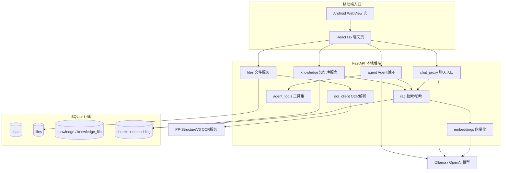

# MyOpenWeb — 企业研发/运维 AI Copilot 工作台

面向研发、运维、交付团队的移动端 AI 助手：**Android 原生壳 + React H5 流式聊天 + FastAPI 分层后端 + 自研 RAG 知识库 + 工具型 Agent**，全本地运行、零外部服务依赖，可企业内网私有化部署。

> RAG 与 Agent 全部自研（不依赖 LangChain / Dify），每一层都能讲清底层实现；架构参考 [Open WebUI](https://github.com/open-webui/open-webui) 拆解重建。

## 核心能力

- **知识库问答（RAG）**：建库 → 上传文件 → 切片向量化 → 余弦 topK 召回 → 带 `[序号]` 引用来源回答；库外问题明确拒答，不编造
- **文档解析**：txt / md / pdf / docx 文本抽取；扫描件、复杂表格可选接入 PaddleOCR PP-StructureV3 输出版面感知 Markdown，服务不可达时优雅降级
- **研发/运维 Agent 工具**：日志分析（级别统计/异常归因/排查建议）、Git diff 变更摘要与风险点、工单结构化总结、测试用例生成
- **RAG × Agent 融合**：Agent 自主决定调用 `search_knowledge` 检索知识库，全过程写入运行日志（`agent_runs` / `agent_steps`），前端可展开查看每一步
- **多模型接入**：Ollama（原生 `/api/chat`，NDJSON 自动转 OpenAI SSE）与任意 OpenAI Compatible 接口，前端只维护一种流解析
- **移动端入口**：Android WebView 壳 + JS 桥接原生语音输入（STT）、语音播报（TTS）、文件选择、安全区适配
- **长期记忆**：手动维护偏好/事实/项目记忆，按开关注入 Agent 上下文
- **全量持久化**：对话、配置、文件、知识库、向量、Agent 日志全部落 SQLite，重启不丢

<!-- 界面预览（录制演示视频后补充 2-3 张截图与视频链接）
## 界面预览

| 知识库问答（引用来源） | Agent 工具调用 | 移动端 |
|---|---|---|
|  |  |  |

演示视频：[3 分钟完整演示](链接)
-->

## 总体架构



## 技术栈

| 层级 | 技术 |
|------|------|
| 前端 | React 18 + TypeScript 5 + Vite 5 + Tailwind CSS 3 + Zustand |
| 后端 | Python 3.12 + FastAPI + SQLite（内置 sqlite3，向量存 JSON + numpy 余弦检索） |
| 模型 | Ollama（默认 `qwen3.5:4b` 对话 / `bge-m3` 向量化）或任意 OpenAI Compatible |
| OCR（可选） | PaddleOCR PP-StructureV3，独立 venv 独立服务，CPU 可跑 |
| 移动端 | Kotlin + WebView（API 26+），JS 桥接原生能力 |

## 快速开始

前置：Python 3.12、Node 18（见 `.nvmrc`）、pnpm、[Ollama](https://ollama.com)。

```bash
# 1. 拉取模型
ollama pull qwen3.5:4b
ollama pull bge-m3

# 2. 后端（首次自动建 venv 装依赖）
#    Windows：双击 start-backend.bat，或
powershell -ExecutionPolicy Bypass -File scripts/dev-server.ps1
#    WSL/Linux：
python3 -m venv .venv && ./.venv/bin/pip install -r server/requirements.txt
pnpm dev:server

# 3. 前端
pnpm install
pnpm dev
```

打开 `http://localhost:5173`：设置里点「测试连接」确认模型可达 → 顶部「知识库」建库并上传文档 → 「建立/重建索引」→ 「聊天使用」选中后提问即可看到带引用来源的回答。

可选 OCR 服务（扫描件/表格解析）：`powershell -ExecutionPolicy Bypass -File scripts/ocr-server.ps1`，然后在设置里开启「OCR 文档解析」。

## 核心设计与取舍

- **为什么自研 RAG / Agent 而不用 LangChain、Dify**：目标是把检索与工具调用的每一步（切片策略、相似度计算、拒答规则、工具循环上限、运行日志）做成可解释、可调试的白盒；规模上来后再按接口替换为框架或向量库，`repositories` 层已预留切换点。
- **向量为什么存 SQLite**：个人/小团队规模下，`chunks` 表存 JSON 向量 + numpy 内存余弦已足够（百级文档毫秒级响应），省去向量库部署成本，正好匹配"企业内网轻量私有化"场景；预留 PostgreSQL + pgvector 迁移方案。
- **防幻觉**：强约束 system prompt（只依据参考资料回答）+ 引用来源展示 + 检索未命中时明确拒答 + 换 embedding 模型导致维度不一致时拒用旧索引并提示重建。
- **可观测性**：Agent 每轮的模型判断、工具调用、工具结果、最终回答全部落库，`GET /api/agent/runs/{id}` 可回放，前端可展开。
- **工具安全**：工具由后端白名单实现，模型只能表达"调用意图"，不能执行任意代码；计算器用表达式解析器而非 `eval`。
- **协议统一**：Ollama NDJSON、OpenAI SSE 在后端统一转换为 OpenAI SSE，前端只有一条流解析路径。

## 项目结构

```text
├── android/          # Android WebView 壳（Kotlin，STT/TTS/文件/安全区桥接）
├── server/           # FastAPI 后端（routers / services / repositories / schemas 分层）
│   ├── services/     # providers / rag / embeddings / agent_runner / agent_tools / file_extract / ocr_client
│   └── ocr/          # 可选 PaddleOCR 独立服务依赖
├── src/              # React H5（apis / components / stores / bridge）
├── scripts/          # 一键启动脚本（后端 / OCR）
└── docs/             # 架构文档、RAG+Agent 模块文档、Open WebUI 对照分析、排障手册
```

## 文档

- [项目架构](docs/project-architecture.md)：技术栈、数据流、数据库设计、Bridge 协议
- [RAG + Agent 模块](docs/rag-agent-copilot.md)：能力总览、API 参考、使用步骤、设计取舍
- [Open WebUI 对照分析](docs/open-webui-analysis.md)：参考项目的拆解与借鉴边界
- [排障手册](docs/troubleshooting.md)

## Roadmap

- [x] RAG 知识库（切片 / 向量化 / topK / 引用 / 拒答）
- [x] 研发/运维 Agent 工具 + 运行日志
- [x] PaddleOCR 扫描件解析（可选服务）
- [ ] 混合检索（BM25 + 向量 RRF 融合）与 bge-reranker 重排
- [ ] 检索质量评测（Recall@K / MRR 参数对照）
- [ ] Docker 一键部署
- [ ] PostgreSQL + pgvector 可切换向量后端
- [ ] Agent 中间过程流式推送

## License

MIT
