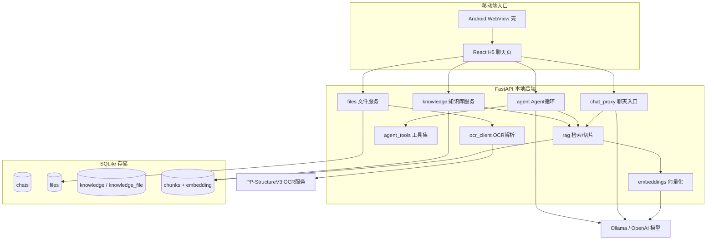

# 企业研发/运维 AI Copilot（RAG + Agent）功能模块

> 本文档覆盖 RAG 知识库与研发/运维 Agent 工具这一功能模块的：能力总览、架构、数据流、API、使用步骤、求职作品包装（简历/面试/一页介绍/演示脚本）、以及后续扩展预案。
> 通用项目架构见 `docs/project-architecture.md`，常见问题见 `docs/troubleshooting.md`。

## 1. 能力总览

把原本的「本地聊天骨架」补齐成可作为求职作品的「企业研发/运维 AI Copilot 工作台」，新增三块自研能力：

1. 文件落盘 + 文本抽取：上传 txt/md/pdf/docx/图片，后端抽取纯文本并落盘（PDF/扫描件/图片可选走 PaddleOCR），独立 `files` 表。
2. RAG 知识库：建库 → 挂文件 → 切片向量化 → 提问时余弦 topK 召回 → 带引用回答 → 库外问题拒答。
3. 研发/运维 Agent 工具：日志分析、Git diff 摘要、工单总结、测试用例生成，并能让 Agent 自己决定调用 `search_knowledge` 查知识库。

全程自研、零额外服务部署（向量直接存 SQLite，内存余弦检索），便于面试讲清底层，也便于小规模私有部署。

## 2. 架构



### 关键设计取舍

- 向量存 SQLite：`chunks.embedding` 存 JSON 数组，查询时用 numpy 内存余弦相似度。个人/演示规模足够，省去额外向量库部署。
- 不用 Dify：RAG 与 Agent 都自研，面试更好讲底层；Dify 仅作为后期可选编排 provider 的扩展点。
- 普通聊天 vs Agent 两条 RAG 路径：
  - 关闭 Agent + 选了知识库 → `/api/chat/completions`，后端直接检索并把片段注入 system_prompt（确定性强）。
  - 开启 Agent + 选了知识库 → `/api/agent/completions`，把 `search_knowledge` 作为工具交给模型自主调用（更智能体化）。
- 无答案拒答：检索为空时注入"知识库中没有找到相关信息"的拒答提示，避免幻觉。
- 维度保护：换了 embedding 模型导致向量维度不一致时，检索返回空并提示重建索引。

## 3. 核心数据流

### 3.1 文件上传 + 抽取

```text
选择文件 → POST /api/files (multipart)
→ file_extract.extract_text()（pdf=pypdf / docx=python-docx / 其余按文本解码）
→ 落盘 server/data/files/<id><ext>，元数据与文本写入 files 表
→ 返回 FileRecord（含 text_preview / text_length）
```

### 3.2 建立索引

```text
知识库绑定文件 → POST /api/knowledge/{id}/index
→ 取出每个文件的 text_content
→ rag.split_text() 按字符 + 自然边界 + overlap 切片
→ embeddings.embed_texts() 分批向量化（默认 16/批）
→ replace_chunks() 原子替换该知识库的全部 chunks
→ 返回 {files, chunks, embedding_model}
```

### 3.3 检索增强问答

```text
聊天带 knowledge_id → chat_proxy
→ rag.retrieve_for_chat()：取最后一条用户消息为 query
→ query_knowledge()：向量化 query + numpy 余弦 topK
→ 命中：拼"带 [序号] 来源标注的参考资料"system_prompt + 返回 sources
→ 未命中：注入拒答提示
→ 流式响应前先 emit 一条 {"sources":[...]} SSE，前端展示"引用来源"
```

### 3.4 Agent 调用知识库

```text
Agent 模式 + knowledge_id → agent_runner
→ 工具列表追加 search_knowledge
→ 模型决定调用 search_knowledge(query, top_k)
→ 后端异步 query_knowledge()，把片段回填给模型
→ 命中片段去重后作为 sources 一并返回；agent_steps 记录该工具调用
```

## 4. API 参考

### 文件 `/api/files`

| 方法 | 路径 | 说明 |
|------|------|------|
| GET | `/api/files` | 文件列表（元数据 + 文本预览） |
| POST | `/api/files` | multipart 上传，抽取文本并落盘 |
| GET | `/api/files/{id}` | 文件详情（含全文 `text_content`） |
| POST | `/api/files/{id}/reextract` | 对已存文件重新抽取（开启 OCR 后回填新文本，需随后重建索引） |
| DELETE | `/api/files/{id}` | 删除文件（含磁盘文件） |

### 知识库 `/api/knowledge`

| 方法 | 路径 | 说明 |
|------|------|------|
| GET | `/api/knowledge` | 知识库列表（含文件数/分块数） |
| POST | `/api/knowledge` | 新建知识库 |
| GET | `/api/knowledge/{id}` | 知识库详情（含文件列表） |
| PUT | `/api/knowledge/{id}` | 改名/改描述 |
| DELETE | `/api/knowledge/{id}` | 删除知识库（级联 chunks/绑定） |
| POST | `/api/knowledge/{id}/files` | 绑定文件 `{file_id}` |
| DELETE | `/api/knowledge/{id}/files/{file_id}` | 解绑文件 |
| POST | `/api/knowledge/{id}/index` | 建立/重建索引 |
| POST | `/api/knowledge/{id}/query` | 调试检索 `{query, top_k}` |

### 聊天 / Agent 扩展

- `POST /api/chat/completions` 与 `POST /api/agent/completions` 新增可选字段：`knowledge_id`、`rag_top_k`。
- 流式响应中通过 `data: {"sources":[...]}` 事件回传引用来源（前端 `streaming.ts` 解析 `parsed.sources`）。

## 5. 使用步骤（本地）

1. 安装后端依赖（新增 `python-multipart`、`pypdf`、`python-docx`、`numpy`）：
   ```bash
   ./.venv/bin/pip install -r server/requirements.txt
   ```
2. 拉取 embedding 模型（Ollama，默认 `bge-m3`，适合中文）：
   ```bash
   ollama pull bge-m3
   ```
   如需更轻量可改用 `nomic-embed-text`，并在「设置 → 知识库 / RAG → Embedding 模型」里填写后点"保存连接配置到后端"。
3. 启动后端与前端：`start-backend.bat` / `pnpm dev:server` + `pnpm dev`。
4. 顶部导航点「知识库」图标 → 新建知识库 → 上传文件 → 点「建立 / 重建索引」。
5. 在知识库列表点「聊天使用」选中该库（导航栏出现"知识库"标记），回到聊天提问。
6. 回答下方点「引用来源」即可看到命中的文件与片段；问库外问题会拒答。
7. 想体验智能体路径：在设置里开启「Agent 模式」，再选知识库提问，Agent 会自己调用 `search_knowledge`，可展开"Agent 调用工具"查看过程。

## 6. 求职作品包装

### 6.1 简历项目描述（可直接粘贴）

**建议简历标题**（任选其一，按目标岗位调整）：移动端 AI 应用工程师 / AI Agent 应用工程师 / AI 应用工程化工程师。

**项目段落（精简版，适合一行项目栏）**：

> 企业研发/运维 AI Copilot 工作台（独立设计与实现）：Android 原生壳 + React H5 流式聊天 + 自研 RAG 知识库 + 工具型 Agent，FastAPI 分层后端、多模型适配，可企业内网私有部署，用于知识问答、运维排障与研发提效。

**项目段落（完整版，可直接粘贴）**：

> 独立设计并实现「企业研发/运维 AI Copilot 工作台」：Android 原生壳 + React H5 流式聊天 + WebView 桥接（语音输入/播报、文件选择、安全区），FastAPI 本地后端分层（routers/services/repositories/schemas），统一 OpenAI SSE，接入 Ollama / OpenAI Compatible 多模型。自研 RAG 知识库（文件落盘与 txt/md/pdf/docx 文本抽取、切片、向量化、SQLite 存向量、numpy 余弦 topK 检索、引用来源标注、库外问题拒答）；实现研发/运维 Agent 工具（日志分析、Git diff 摘要、工单总结、测试用例生成）并与 RAG 融合（Agent 自主调用 `search_knowledge`，全过程写入运行日志）。可用于企业内网智能问答、运维排障与研发提效。

**如何结合你的真实经历讲（重要，别写成通用项目）**：

- 用 19 年研发与「掌上运维 / 装机助手 / 故障中心 / 资源中心」的背景，把这个产品定位成"我最懂的企业运维/研发场景"的 AI 落地，而不是泛泛的聊天机器人。
- Android + H5 + WebView 桥接是你的差异化护城河——市场上纯做 RAG 的人很多，但"能把 AI 做进移动端、还懂企业系统联调与线上排查"的人少。
- Agent 工具（日志分析、Git diff 摘要、工单总结）直接对应你过去做线上问题排查、版本变更、工单处理的真实经验，面试时用真实案例讲会非常可信。
- 善用 Cursor/Codex/Claude Code：可以讲"用 AI Coding 工作流把这个产品从 0 到 1 独立交付"，正好对上"AI Coding / 研发效能"岗位。

**可量化的点（按真实情况填）**：知识库文件数 / 分块数（如 193 块）、检索 topK 与响应时延、支持的文件类型数（4 种）、Agent 工具数（4+1）、从 0 到 1 的交付周期（如 4 周）。

### 6.2 面试话术（高频问题）

- **整体架构一句话**：移动端（Android 壳 + React H5 流式）→ FastAPI 分层后端（routers/services/repositories/schemas，统一 OpenAI SSE）→ 自研 RAG + 工具型 Agent → 多模型（Ollama / OpenAI Compatible），数据全落 SQLite，可私有部署。
- **RAG 是怎么实现的？**：文本抽取 → 按字符 + 自然边界 + overlap 切片 → embedding 批量向量化入库（SQLite 存 JSON 向量）→ 查询时把 query 向量化后用 numpy 算余弦相似度取 topK → 把命中片段带 `[序号]` 来源拼进 system_prompt → 让模型只依据资料回答，未命中则拒答。
- **为什么不用向量数据库 / Dify？**：个人/演示规模 SQLite + 内存余弦足够，且能讲清每一步；强调"自己写的"比"拖流程"更有说服力。架构上预留了 PostgreSQL + pgvector 与 Dify provider 扩展点，规模上来按接口替换实现即可。
- **怎么防幻觉 / 保证可信？**：强约束 system_prompt（只用参考资料、未命中明确说不知道）、返回引用来源给前端展示、embedding 维度不匹配时拒绝用旧索引并提示重建。
- **Agent 和普通 RAG 的区别？**：普通 RAG 是后端确定性检索后注入 system_prompt（结果稳定、好复现）；Agent 把检索做成 `search_knowledge` 工具，由模型自主决定是否检索、检索什么，并记录工具调用日志，更接近"智能体"。两种路径按场景选用。
- **（加分，体现迭代）两条路径的拒答怎么保持一致？**：最初 Agent 模式拒答偏松，问库外问题会用通用知识发挥；后来在"选中知识库"时给 Agent 注入了拒答约束（检索为空或不相关就明确说"知识库中没有找到相关信息"），让 Agent 路径与普通 RAG 路径的拒答行为统一。这是从实测里发现并修掉的问题，能体现工程迭代意识。
- **切片大小/overlap 怎么定的？**：按字符切并优先在自然边界（段落/句子）断开，留 overlap 防止答案被切断；可按文档类型调参。讲清"为什么不是越大越好/越小越好"的权衡即可。
- **工程化体现在哪？**：分层后端、统一 SSE 协议、Provider/embedding 的 WSL→Windows 主机回退、运行日志可观测、依赖可降级（缺 pdf/docx 库时报清晰错误而非崩溃）、配置持久化到后端。
- **移动端怎么接的？**：Android WebView 壳 + JS 桥（moaBridge）打通语音输入/TTS 播报/文件选择/安全区；H5 走统一后端 SSE，和桌面端共用一套接口。这是我相对纯算法/纯后端候选人的差异化优势。

### 6.3 一页产品介绍

- 名称：企业研发/运维 AI Copilot 工作台
- 定位：面向研发、运维、交付团队的移动端 AI 助手
- 核心能力：知识库问答（带引用、可拒答）、日志分析、故障排查、接口/工单理解、测试用例生成、代码变更摘要、语音交互
- 技术亮点：移动端原生壳 + H5 流式、自研 RAG、工具型 Agent、多模型适配、全本地可私有部署
- 适用场景：企业内网知识问答、运维排障、研发提效、传统企业轻量私有化

### 6.4 演示视频脚本（3–5 分钟，可照着录）

> 重要：演示「严格拒答」用普通模式（关闭 Agent），库外问题会干净拒答；演示「智能体」再开 Agent 模式。
> 知识库内容建议：岗位定位是研发/运维 Copilot，演示时最好用「运维手册 / 接口文档 / 故障案例」做知识库更贴合；现有「药品手册」可作为第二个垂直案例。下面脚本两种内容都适用，括号里给出基于现有药品库的示例问法。

#### 录制前检查清单（30 秒过一遍）

- [ ] 后端 8000 / 前端已启动，`/api/health` 返回 `{"ok":true}`
- [ ] 设置里 Provider 已连通、模型已选好、Embedding 模型=`bge-m3`，已点过「保存连接配置到后端」
- [ ] 目标知识库已「建立/重建索引」，列表显示分块数（如 193）
- [ ] 新建一个干净对话，避免历史串味
- [ ] 准备好 2 段素材：一段异常日志、一段 git diff（贴进输入框即可）

#### 分镜脚本

1. 开场（约 20s）：一句话定位"面向研发/运维团队的移动端 AI 助手，知识库问答 + 工具型 Agent，全自研、可私有部署" → 手机/H5 打开，随便问一句展示流式输出与语音按钮。
2. 知识库问答 + 引用（约 70s，**普通模式**）：
   - 顶部「知识库」→ 展示已建库、上传的文件列表与分块数 → 点「聊天使用」选中（导航栏出现"知识库"标记）。
   - 问一个**库内**问题（示例："坎地沙坦胶片有什么用？""蒙脱石散有什么注意事项？"）→ 得到回答后点开「引用来源」，展示命中的文件名与片段。
3. 库外拒答（约 30s，**普通模式**）：问一个明显**库外**问题（示例："你知道建筑历史吗？""今天天气怎么样？"）→ 展示模型明确回答"知识库中没有找到相关信息"，强调"不乱编"。
4. 研发/运维 Agent 工具（约 80s，**开启 Agent 模式**）：
   - 点「日志分析」快捷按钮，贴入异常日志 → 得到结构化的错误级别/异常类型/根因与排查建议。
   - 点「Git diff 摘要」，贴入一段 diff → 得到变更文件、增删行、风险点。
   - 展开「Agent 调用工具」查看本轮调用过程。
5. RAG × Agent 融合（约 40s，**Agent 模式 + 选中知识库**）：问库内问题 → 展示 Agent 自主调用 `search_knowledge`、回答带「引用来源」，并能展开看工具调用；再问一个库外问题，展示同样会拒答（已统一两条路径的拒答行为）。
6. 收尾（约 20s）：一句架构小结（移动端壳 + H5 流式 + FastAPI 分层 + 自研 RAG + 工具型 Agent + 多模型）+ 强调"全自研、零额外服务、可私有部署"。

#### 旁白可直接念的关键句

- "检索命中时回答带可点击的引用来源；问知识库以外的问题会直接拒答，避免幻觉。"
- "Agent 模式下，检索被封装成 `search_knowledge` 工具，由模型自己决定何时查、查什么，整个调用过程有日志可回溯。"
- "整套 RAG 和 Agent 都是自研的，向量直接存 SQLite、用 numpy 算余弦相似度，不依赖外部向量库或编排平台，方便企业内网私有部署。"

## 7. OCR 文档解析（PP-StructureV3）

针对扫描件/图片型 PDF、复杂表格、印章等 `pypdf` 抽不出内容的场景，新增一条可选的 OCR 解析通道。

### 设计取舍
- OCR 作为**独立本地服务**（PaddleOCR PP-StructureV3，CPU 可跑），后端通过 HTTP 调用，复用 Ollama 那套“可配置 URL + WSL→Windows 主机回退”。
- **主后端依赖保持精简**：paddle 相关依赖只装在独立 venv（`server/ocr/requirements.txt`），不进 `server/requirements.txt`，后端启动不受影响。
- **默认关闭、优雅降级**：未开启或服务不可达时退回 `pypdf`，上传永不失败（失败仅记一条 warning）。
- **触发模式**：`auto`（仅当 pypdf 文本为空/过短、判定为扫描件时才 OCR）/ `always`（PDF、图片都走 OCR）。
- **输出版面感知 Markdown**（保留标题/表格/阅读顺序），再喂给现有 `rag.split_text` 切片，提升召回质量。

### 相关文件
- `server/services/ocr_client.py`：base64 调用 PP-StructureV3 serving 的 `POST /layout-parsing`，解析 `result.layoutParsingResults[].markdown.text` 拼成全文。
- `server/services/file_extract.py`：`extract_text_async()` 按文件类型/模式决定是否走 OCR；图片类型必须开启 OCR 才解析。
- 配置项：`ocr_enabled` / `ocr_base_url`（默认 `http://localhost:8118`）/ `ocr_mode`，存于 `app_config`；前端在“设置 → 知识库 / RAG → OCR 文档解析”填写后点“保存连接配置到后端”。

### 启动 OCR 服务（独立 venv）
- Windows：`powershell -ExecutionPolicy Bypass -File scripts/ocr-server.ps1`
- WSL/Linux：`bash scripts/ocr-server.sh`
- 首次会建 `server/ocr/.venv` 并安装 `paddlepaddle` + `paddleocr`（约几百 MB，需联网），服务监听 `:8118`。确切 serving CLI 可能随 PaddleOCR/PaddleX 版本变化，失败时查官方 serving 文档。

### 使用步骤
1. 启动 OCR 服务（见上）。
2. 设置里开启“OCR 文档解析”，填服务地址与模式，保存到后端。
3. 新上传的 PDF/图片会按模式自动走 OCR；**已上传的文件**可在知识库文件列表点“重新抽取”，随后再“建立 / 重建索引”即可让旧文件用上 OCR 文本。

## 8. 后续扩展预案（仅方案，未实现）

- **Docker 一键部署**：多阶段构建前端静态资源 + FastAPI，`docker-compose` 编排后端与（可选）Ollama；数据卷挂载 `server/data`。
- **PostgreSQL + pgvector 迁移**：把 `chunks.embedding` 改为 `vector` 列，检索改为 SQL `ORDER BY embedding <=> :q LIMIT k`；`repositories` 层接口不变，替换实现即可，便于写"企业级"简历。
- **检索增强**：加入 rerank（如 bge-reranker）、BM25 + 向量混合检索、按文件增量索引。
- **Dify 作为可选编排 provider**：把 Dify 作为一种 provider 接入，复杂工作流交给 Dify，简单场景仍走自研链路。
